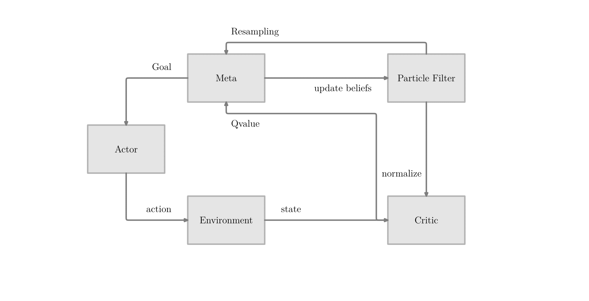
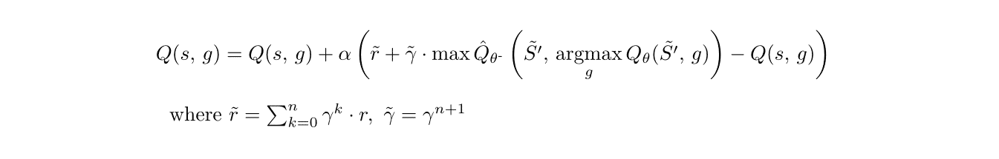
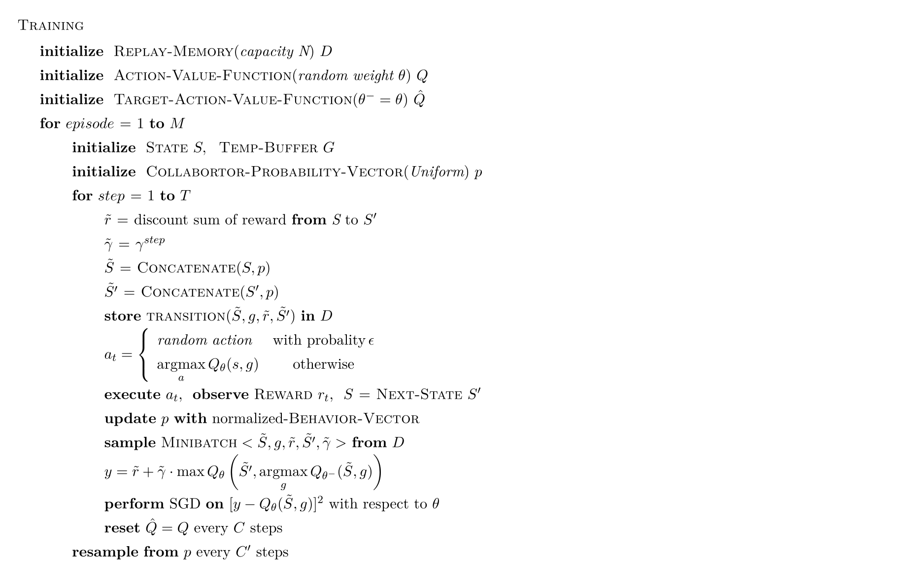
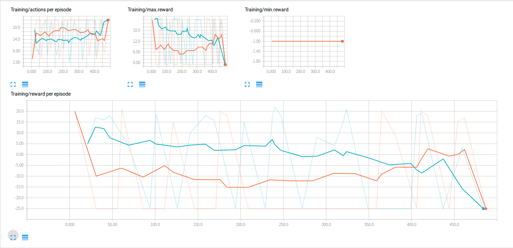

# Hierarchical Double Deep Q-Network (HiDDeN)
Minghan Li, Fan Mo, Ancong Wu

----
### Abstract
The difficulty of this challenge comes from the uncertainty of the collaborator’s behavior and the conditions of success. Under the context of this task, we hope the agent can learn strategies like flanking and ambushing as well as taking advantage of the behavioral pattern of the collaborator. Therefore, temporal abstraction and inference are needed for this specific task. We make three main contributions in this work:
1. Combine Double Deep Q-Network [[3]](#reference) with the option framework [[2]](#reference) to produce the Hierarchical Double Deep Q-Network, or HiDDeN;
1. Add particle filter [[4]](#reference) module to make inference to the collaborator’s behavior;
1. Develop a technique called “Goal Swapping” to speed up the learning process.

Because of the our limited resources, we have to split up the learning process into data collecting on CPUs and training on GPUs. As we know the model will be likely to overfit the dataset in this way, especially for the model like neural network. However, the result does show that with HiDDeN, the agent is able to learn some high level strategies and emerges collaborative patterns.

### Introduction
The task of this Pig Chase Challenge basically requires us to design a agent to cooperate with another one to catch a pig in a fence, which is worth 25 points. The agent can also choose to go to the lapis blocks to get 5 points and end the game early. The agent will be tested with multiple kinds of cooperators and see it's overall performance. The link of this challenge is [here](https://github.com/Microsoft/malmo-challenge/blob/master/ai_challenge/pig_chase/README.md).

### Model structure

>Figure 1: The Critic contains a Deep Q-Network[1], outputs Q-values for each goal given the current state. The Meta is the central controller of the hierarchical model, receives Q-values from the critic and specifies the goal. The Actor is an AStar agent, which moves greedily to the current goal. The particle filter module is used to encode the behavior of our collaborator.

The temporal abstractions (high level strategies) are usually very difficult to define, even to be learned [[5]](#reference). Thus, we use the concept of sub goals [[6]](#reference), which are specific coordinates in this task. Therefore the Q-value function we use is Q(s, g) instead of Q(s, a). It avoids training the agent using primitive actions and  speeds up the data collecting process.

**Critic Module:**
The Critic uses a fully connected neural network with 4 hidden layers, each layer has 1024 neurons with a rectifier nonlinearity. It takes modified state feature vector and the goal as input, i.e. Q(s, g). To stabilize the training process and break the correlation between the data, we also use experience replay and target network [[1]](#reference) in our model.

Q-learning is known to have the overestimation problem, especially in the non-stationary and stochastic environment, which can be addressed by double q learning [[7]](#reference). In order to incorporate double q learning into DQN, we use the method from [[3]](#reference), where they proposed using the target network to estimate the current network’s Q value. Now we have a new update rule:

**Meta Module:**
The Meta produces goal based on the Q value from the critic, and it also uses particle filtering [[4]](#reference) to update the agent’s belief about the behavioral pattern of the collaborator. We use a vector to encode the collaborator’s type by using the noisy reading from its behavior. By doing resampling from the normalized probability vector in each episode, we can make our agent to be more adaptive to the changes of the collaborator’s behavior. The normalized vector will also be concatenated with the state feature vector to be the input of the Critic.

**Actor Module:**
It basically is an AStar agent, which receives goal from Meta and act greedily to it. The code for the Actor Module is modified from the provided AStar agent [[8]](#reference).

**Goal swapping:**
We invent a method called “goal swapping” to gain data efficiency and speed up the data collecting process. At the data collecting process we don’t use Meta to output a goal, but instead, we use our current location as the goal to update all the previous states within an episode. In this manner, say if our episode is 25 steps long, then we can gather 325(sum 1 to 25) data within one episode.

### HiDDeN Algorithm
Since we didn’t deploy Project Malmo on our GPU machine, the whole learning process has to be split up into two stages: data collecting on CPUs and training on GPUs.

#### Online HiDDeN Algorithm

#### Offline HiDDeN Algorithm

### Evaluation (compare with the baseline)

>Figure 2: The results of HiDDeN vs Focused and Focused vs Focused. The Red Line represents the Fouced agent and the Blue one represents HiDDeN agent. We can see our method indeed outperforms the astar heuristics.

---
### Reference
* [1] Mnih V, Kavukcuoglu K, Silver D, et al. Human-level control through deep reinforcement learning[J]. _Nature, 2015, 518(7540): 529-533._
* [2] Sutton R S, Precup D, Singh S. Between MDPs and semi-MDPs: A framework for temporal abstraction in reinforcement learning[J]. _Artificial intelligence, 1999, 112(1-2): 181-211._
* [3] Van Hasselt H, Guez A, Silver D. Deep Reinforcement Learning with Double Q-Learning[C]. _AAAI. 2016: 2094-2100._
* [4] Del Moral P. Non-linear filtering: interacting particle resolution[J]. _Markov processes and related fields, 1996, 2(4): 555-581._
* [5] Bacon P L, Harb J, Precup D. The option-critic architecture[J]. _arXiv preprint arXiv:1609.05140, 2016._
* [6] Dayan P, Hinton G E. Feudal reinforcement learning[C]. _Advances in neural information processing systems. Morgan Kaufmann Publishers, 1993: 271-271._
* [7] Hasselt H V. Double Q-learning[C]. _Advances in Neural Information Processing Systems. 2010: 2613-2621._
* [8] Microsoft Co. Task and example code for the Malmo Collaborative AI Challenge, [_Github code_](https://github.com/Microsoft/malmo-challenge)

### Installation Dependencies
* Python 2.7
* Tensorflow 1.0
* MessagePack
* Numpy
* [Other Dependencies](https://github.com/Microsoft/malmo-challenge)

1. After you install all the dependencies, put the HiDDeN in malmo-challenge/ai_challenge/pig_chase/([downloads](https://github.com/Microsoft/malmo-challenge/blob/master/ai_challenge/pig_chase/README.md)), and run

 **python test.py**
 
to see the agent's performance. If you want to retrain the agent, simply type:

 **python train.py**
 
or you want use GPUS, it requires tensorflow 0.8 rather than 1.0, type:

 **python train_gpu.py**

### Video Link
* [Video](https://youtu.be/GR5rj8rRy1c)
